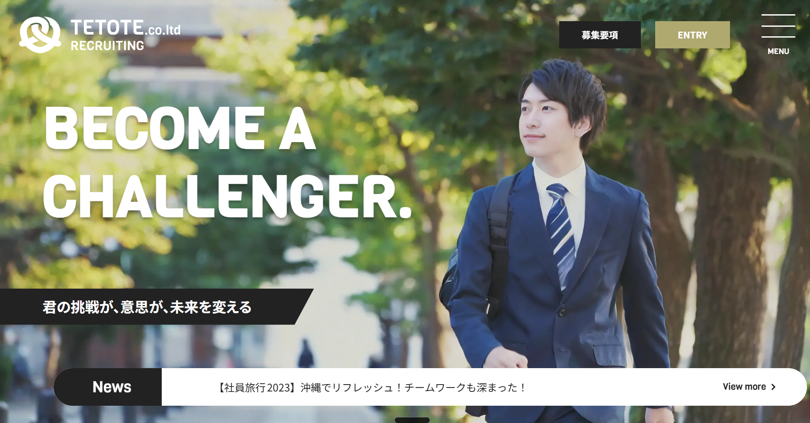

# TETOTE 採用特設サイト



## プロジェクト概要

- **サイト名**：採用特設サイト｜株式会社TETOTE
- **目的・コンセプト**：企業のコーポレートサイトとは切り離した「採用特設サイト」として、求職者に向けて働く人・社風の魅力を伝えることを目的としたサイトです。デザインカンプをもとにした架空企業の課題制作で、動きのある表現とアクセシビリティの両立をテーマに実装しました。
- **位置づけ**：WordPressオリジナルテーマとして本格的に取り組んだ**1作品目**です。ここで得たコンポーネント設計・アクセシビリティ・パフォーマンスの知見を、2作品目「[デイマガ](https://github.com/amemori0/daymaga-portfolio)」でCMS運用を見据えた設計へ発展させています。

## 技術スタック

- **言語・CMS**：HTML / SCSS / JavaScript / PHP（WordPress オリジナルテーマ）
- **CSS設計**：FLOCSS + BEM
- **ライブラリ**：GSAP（ScrollTrigger）、Swiper.js
- **プラグイン**：Contact Form 7、Breadcrumb NavXT
- **開発環境**：Vite、`@wordpress/env`（Docker）、yarn

## 主な実装機能

- トップページ（`front-page.php`）
- 採用ブログ一覧（`home.php`）／記事詳細
- スタッフ紹介（カスタム投稿タイプ `staff` ＋ `archive-staff.php`）
- 固定ページ（会社紹介 `page-about-us.php`、福利厚生 `page-benefits.php` など）
- エントリーフォーム（Contact Form 7・カスタムスタイリング）
- パンくずリスト（Breadcrumb NavXT 連携）

## 工夫した点

### 設計方針

#### コンポーネントに幅・配置を強制しない設計

- **実装**：component層（`c-*`）には幅や外側marginなど「置かれる場所に依存するスタイル」を持たせず、幅の決定はproject層（`p-*`）に委ねました。たとえばスタッフカード本体（`_c-staff-card.scss`）は装飾のみで幅指定を持たず、カードの列幅はproject層で指定しています。

  ```scss
  /* components/_c-staff-card.scss — 幅を持たず装飾だけ */
  .c-staff-card {
    position: relative;
  }

  /* projects/_p-top-staff.scss — 置かれる場所側で幅を決める */
  .p-top-staff__swiper-slide {
    width: min(calc(300 * var(--to-rem)), 100%);
  }
  ```

- **理由**：コンポーネント自身が幅を持つと、別の場所へ再配置したときに意図しない幅が引き継がれてレイアウトが壊れやすいためです。
- **効果**：同じカードを一覧・スライダーなど幅の異なる文脈へ再利用でき、上書きの打ち消し作業が不要になりました。

#### マジックナンバーの回避（カスタムプロパティ + calc）

- **実装**：数値を直接置かず、`--to-rem`（px値をremへ換算するカスタムプロパティ）や意味を持たせたローカル変数で「何の値か」を表現しています。流体サイズには `clamp()` を用いています。

  ```scss
  /* components/_c-accordion.scss */
  .c-accordion__item {
    --_q-gap: calc(20 * var(--to-rem));
    --_q-fs: calc(24 * var(--to-rem));
  }
  .c-accordion__content-inner {
    /* 「Qラベルの幅 + 余白」を式で表現し、意図を残す */
    padding-inline-start: calc(var(--_q-gap) + var(--_q-fs));
  }
  ```

- **理由**：裸の数値は「なぜその値か」がコードから読み取れず、変更時の影響範囲も追いにくいためです。
- **効果**：値の意味と依存関係がコードに残り、サイズ調整が1変数の変更で完結するようになりました。

#### 翻訳されたくない固有名詞（ロゴ）に `translate="no"`

- **実装**：ブランド名を含むロゴリンクに `translate="no"` を付与しています（`template-parts/header.php:3` / `footer.php:9`）。

  ```php
  <a href="<?php echo esc_url(home_url("/")); ?>" translate="no" aria-label="TETOTE トップページへ">
  ```

- **理由**：ブラウザの自動翻訳が固有名詞（TETOTE）を別語へ置き換えると、ブランド表記が崩れてしまうためです。
- **効果**：翻訳環境で閲覧されてもロゴ・社名が原文のまま保たれます。

### レイアウト・CSS設計

#### CSSのみの無限スクロールスライダー

- **実装**：`data-offset` 属性で各要素の開始位置を管理し、CSSアニメーションのみでループスライダーを実装しました。
- **理由**：装飾目的の流し込み表示にJSライブラリを使うのはオーバースペックで、実行コストも増えるためです。
- **効果**：JS依存ゼロで軽量に動作し、ライブラリの読み込み・初期化コストを削減できました。

#### Swiper.js スタッフカードスライダーの「片側はみ出し」表現

- **実装**：以下の3点セットで、コンテンツ幅の外へカードをはみ出させるデザインを実現しました。
  1. `clip-path: inset(0% -50vw 0% 0%)` でinner幅を越えて右側へ表示
  2. ページ最上位の親要素に `overflow: hidden` を指定し、横スクロールの発生を防止
  3. Swiperがデフォルトで持つ `.swiper { overflow: hidden }` を `overflow: visible` で上書き
- **理由**：単純に `overflow` を外すだけではページ全体に横スクロールが発生し、逆にSwiperのデフォルトのままでは幅外が切り取られて表現が成立しませんでした。
- **効果**：どの画面幅でも横スクロールを発生させずに、カードが画面端へ抜けていく奥行きのある表現を実現できました。

#### flex ＋ コンテナクエリによるレンガ状レイアウト

- **実装**：カード一覧をflexで組み、コンテナクエリで親要素の幅に応じて列数・比率を切り替えるレンガ状（brick）レイアウトを構築しました。
- **理由**：ビューポート基準のメディアクエリでは、同じ一覧コンポーネントを幅の異なる場所へ再配置した際にレイアウトが最適化されないためです。
- **効果**：コンポーネントが「置かれた場所の幅」に自律的に適応するようになり、再利用時のスタイル調整コストが減りました。

#### `grid-template-areas` によるフッターレイアウト

- **実装**：フッターの複数ブロック（ロゴ・ナビ・SNS・コピーライト等）を `grid-template-areas` でエリア名管理しています。
- **理由**：レスポンシブでブロックの並び順が大きく入れ替わるデザインで、floatやflexの順序制御では保守しづらかったためです。
- **効果**：ブレークポイントごとにエリア定義を書き換えるだけで並び替えが完結し、HTMLの順序変更なしで対応できました。

### パフォーマンス

#### hero画像を `` ＋ `fetchpriority="high"` でLCP最適化

- **実装**：ファーストビューの主要画像を `background-image` ではなく `` で置き、`width` / `height` と `fetchpriority="high"` を付与しています（`template-parts/front-page/section-mv.php:9`、`template-parts/hero.php`）。

  ```php
  "
       alt="スーツを着て屋外を爽やかに歩く若い男性ビジネスパーソン"
       width="1440" height="823" fetchpriority="high">
  ```

- **理由**：`background-image` はCSS解析まで発見されない一方、`` はブラウザのプリロードスキャナがHTML解析時点で発見でき、さらに `fetchpriority="high"` で優先取得を明示できるためです。
- **効果**：LCP（最大コンテンツの描画）となるメイン画像の取得が早まり、`width`/`height` 指定でレイアウトシフトも防げます。

#### 画像の上に載るテキストの退避用背景色

- **実装**：画像に重なるヒーローのテキスト領域へ、下地として白背景を指定しています（`src/assets/styles/projects/_p-hero.scss:4`）。

  ```scss
  .p-hero {
    background: var(--color-white); //画像がもし配置されなかった場合でもテキストが読めるようにするため
  }
  ```

- **理由**：画像の読み込みに失敗したり未設定のまま公開された場合、画像前提のテキスト色だと背景に溶けて読めなくなるためです。
- **効果**：画像が出ない状況でもテキストのコントラストが確保され、可読性が担保されます。

### タイポグラフィ・UX

#### `font-feature-settings: "palt"` による日本語の詰め組み

- **実装**：見出しなど和文の要素に `font-feature-settings: "palt"` を広く指定しています（`_c-section-title.scss:10`、`_p-message.scss` ほか多数）。

  ```scss
  .c-section-title--ja {
    font-feature-settings: "palt";
  }
  ```

- **理由**：`palt`（プロポーショナルメトリクス）は約物や仮名の左右アキを字面に応じて詰める指定で、全角ベタ組みで生じる不自然な余白を整えられるためです。
- **効果**：和文見出しの間延びが解消され、採用サイトに求められる真面目・端正な印象のトーンに寄せられました。

#### お問い合わせフォームの `field-sizing: content`

- **実装**：`textarea` に `field-sizing: content` を指定し、対応ブラウザでは `resize` を無効化するフォールバックを併記しています（`_p-entry.scss:379-383`、`foundation/_base.scss:79-81`）。

  ```scss
  .p-entry__textarea {
    field-sizing: content;
    @supports (field-sizing: content) {
      resize: none;
    }
  }
  ```

- **理由**：入力量に応じて高さが自動で伸びると手動リサイズが不要になりますが、未対応ブラウザでは従来通りリサイズできる必要があるためです。
- **効果**：対応ブラウザでは入力に追従して伸びる快適な入力欄になり、未対応環境でも機能が落ちないプログレッシブエンハンスメントを実現しました。

#### アコーディオンの `user-select: none`

- **実装**：開閉トリガーとなる `summary` にテキスト選択を無効化する指定を入れています（`src/assets/styles/components/_c-accordion.scss:19-20`）。

  ```scss
  .c-accordion__summary {
    cursor: pointer;
    user-select: none; //連打による誤選択による青いハイライトを防ぐため
    -webkit-user-select: none;
  }
  ```

- **理由**：開閉のために連打・長押しすると、クリックのつもりが文字を範囲選択して青くハイライトしてしまうためです。
- **効果**：操作時の意図しないテキスト選択がなくなり、ボタンらしい挙動になりました。

### インタラクション・動きの実装

#### スクロール連動のヘッダー配色切り替え（GSAP ScrollTrigger）

- **実装**：GSAPのScrollTriggerで、スクロール位置（通過中のセクション）に応じてヘッダーの背景色・文字色を切り替えています。
- **理由**：セクションごとに背景色が大きく変わるデザインで、固定配色のヘッダーではコントラストが確保できない箇所が生じたためです。
- **効果**：どのセクションを閲覧中でもヘッダーの視認性を維持でき、デザインの世界観を損なわずにアクセシビリティ上のコントラスト要件を満たせました。

### アクセシビリティ

#### 見出し階層を飛ばさない設計

- **実装**：ブログ一覧ページで、h1（ページタイトル）とカードタイトル（h3）の間に、視覚的に非表示のh2を `u-sr-only` で挿入しています。

  ```html
  <h1 class="p-archive-blog">BLOG</h1>
  <h2 class="u-sr-only">採用ブログ記事一覧</h2>
  <article>
    <h3 class="c-card__title">...</h3>
  </article>
  ```

- **理由**：スクリーンリーダーの見出しジャンプは文書全体のh1〜h6を順に辿るため、デザイン上h2に相当する見た目が無くても、レベルの飛び越え（h1→h3）は避けるべきと判断しました。
- **効果**：視覚デザインを変えずに、支援技術利用者にとって一覧の構造が正しく伝わるマークアップになりました。

#### ヘッダー・ドロワーナビのARIA属性

- **実装**：ドロワーの開閉ボタンに `aria-label` / `aria-expanded` / `aria-haspopup` を付与し、開閉に合わせてJS側で `aria-expanded` と `aria-label` を更新しています。装飾SVGは `aria-hidden="true" focusable="false"`、現在ページのリンクには `aria-current="page"` を出力しています（`template-parts/header.php:18-28` ほか）。

  ```php
  <button
    class="p-header__drawer-icon"
    aria-label="メニューを開く"
    aria-expanded="false"
    aria-haspopup="true"
  >
  ```

  ```js
  // src/assets/js/_drawer.js — 状態変化を支援技術へ伝える
  drawerIcon.setAttribute("aria-expanded", "true");
  drawerIcon.setAttribute("aria-label", "メニューを閉じる");
  ```

- **理由**：ネイティブの `<button>` を使うことでキーボード操作（Tab移動・Enter/Space実行）は標準で成立しますが、開閉状態や「これはメニューを開くボタン」という意味は視覚以外に伝わらないためです。
- **効果**：スクリーンリーダー利用者にもメニューの開閉状態・現在地が伝わり、装飾SVGは読み上げ・フォーカスから除外されます。

#### フォーム全般のアクセシビリティ

- **実装**：各入力に `label` の `for` 紐付け、必須マーク `※` は読み上げノイズになるため `aria-hidden="true"`、ラジオ／チェックのグループは `role="group"` ＋ `aria-labelledby` で見出しと関連づけています（`template-parts/entry.php`）。

  ```php
  <label for="entry-name">お名前<span aria-hidden="true">※</span></label>
  ...
  <div class="p-entry__row" data-status="desired-position" role="group" aria-labelledby="label-job-type">
    <div class="p-entry__label">
      <span id="label-job-type">希望職種<span aria-hidden="true">※</span></span>
    </div>
  ```

- **理由**：ラベルとコントロールが関連づいていないと読み上げで項目名が分からず、複数選択肢のグループも「何についての選択肢か」が欠落するためです。
- **効果**：スクリーンリーダーで各項目名・グループの意味が正しく伝わり、強制カラーモード対応（下記）と合わせてフォームの操作性を担保しました。

#### Contact Form 7 のカスタムラジオ／チェックボックス（forced-colors対応）

- **実装**：CF7標準のフォーム部品をデザインに合わせて完全カスタムスタイリングし、`forced-colors` メディアクエリで強制カラーモード時のスタイルを別途定義しました。
- **理由**：擬似要素で選択状態を描画するカスタムUIは、Windowsのハイコントラストモードで配色が無効化され「選択状態が見えない」事故が起きやすいためです。
- **効果**：通常表示ではデザインカンプ通りの見た目を保ちつつ、強制カラーモードでも選択状態が判別できるフォームになりました。

#### スタッフカードの `article` ＋ `aria-labelledby`

- **実装**：カードを見出しを持つ `article` としてマークアップし、`aria-labelledby` でカード内の氏名見出し（`h3`）を参照しています（`template-parts/archive/staff-list.php:29,67-72`、`front-page/section-staff.php:26,46`）。

  ```php
  <article class="c-staff-card" aria-labelledby="staff-name-<?php echo esc_attr($staff_id); ?>">
    ...
    <h3 class="c-staff-card__name" id="staff-name-<?php echo esc_attr($staff_id); ?>">
      <?php the_title(); ?>
    </h3>
  </article>
  ```

- **理由**：カードを独立した記事領域として扱い、支援技術のランドマーク／要素移動で「誰のカードか」を即座に伝えたいためです。
- **効果**：スクリーンリーダーで `article` 単位に辿った際、各カードが氏名でラベル付けされて内容が把握しやすくなりました。

## 開発環境の再現手順

> **Note**: 本リポジトリはコード実装の閲覧を目的としたサンプル公開です。開発用の補助スクリプト（`bin/`）は含めていないため、下記コマンドはそのままではクローン後に動作しません。実装の詳細は `src/` および `wordpress/themes/` 配下のコードを直接ご覧ください。

```bash
# 依存インストール
yarn

# ローカルWordPress + 開発サーバー起動
yarn wp-start
yarn dev

# 本番ビルド（ビルド後に開発用ファイルを自動クリーンアップ）
yarn build:wp

# 環境停止
yarn wp-stop
```
